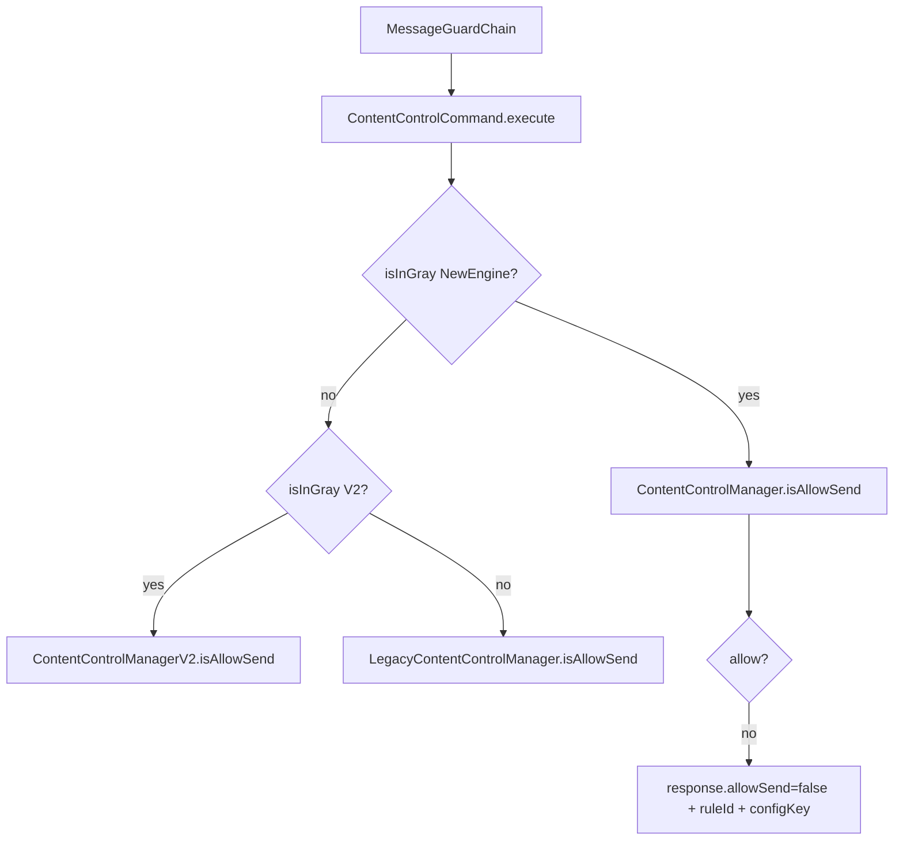
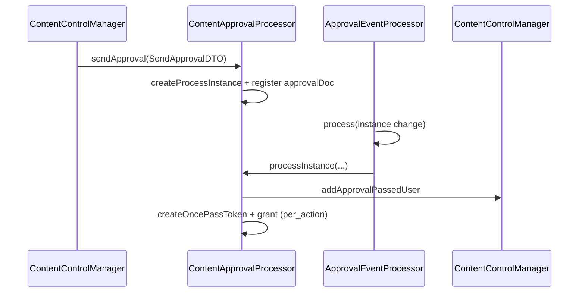

# 分级内容管控 CodeMap（feature）

- 生成时间：2026-02-25 20:10
- 模式：`create_codemap(feature)`
- 范围：分级内容管控（规则管理 + 发送拦截 + 审批回调 + 临时放行）
- 目标：快速定位入口、核心调用链、关键数据结构、灰度门禁与高风险点

---

## 1. 功能边界

本地图覆盖：
- 规则管理（管理接口 + 规则读写）
- IM 发送拦截链（`MessageGuardChain` -> `ContentControlCommand` -> `ContentControlManager`）
- 审批链路（发起审批、审批回调、白名单/一次性令牌）
- 动态用户组与场景匹配
- 模板清理与审批结束后的后处理

本地图不展开：
- 其他安全子域
- 群规模与频控的完整实现细节
- 详细前端配置与菜单渲染

---

## 2. 入口总览

### 2.1 管理侧
- 接口定义：`app/admin/ContentControlService.java`
- 关键方法：
  - 旧版/V2：`listRules/saveRule/deleteRule`
  - 生效范围：`getEffectRange/updateEffectRange`
  - 审批模板：`getApprovalTemplate/initApprovalTemplate`
  - V3：`listRuleV2/saveRuleV2/deleteRuleV2/listRuleV3/saveRuleV3/updateRuleRank`

- 实现与灰度分流：`app/admin/impl/ContentControlServiceImpl.java`
  - `CONTENT_CTRL_V2` 灰度命中走 `ContentControlManagerV2`，否则走 `LegacyContentControlManager`
  - 新规则入口：`saveRuleV2/saveRuleV3/listRuleV3`

### 2.2 消息发送拦截入口
- 链路编排：`app/service/chain/MessageGuardChain.java`
  - 顺序：`MsgSendPreCheck -> MsgForwardCheck -> ContentControlCheck -> FileUploadCheck`
- 内容管控命令：`app/service/chain/ContentControlCommand.java`
  - 主执行：`execute`

### 2.3 审批事件入口
- 主路由：`app/service/mq/ApprovalEventProcessor.java`
  - `process`
  - 内容管控审批配置识别：`getContentControlApprovalConfig`

---

## 3. 灰度与版本路由

关键灰度常量：`app/common/constant/GrayKeys.java`
- `CONTENT_CTRL_V2`
- `CONTENT_CTRL_RULE_ENGINE`
- `CONTENT_CTRL_V3`
- `DYNAMIC_GROUP_MEMBER_CTRL`
- `COMBINE_MSG_CTRL`
- `GROUP_DETAIL_TIP`

版本路由核心在：
- `ContentControlCommand.execute`：先判新规则引擎，再判 V2，再回退旧版
- `ContentControlManager.isAllowSend`：可先跑旧 handler，再按灰度叠加 V3 handler

---

## 4. 发送拦截主链路（IM）

关键节点：
- 数据类型解析：`parseDataTypeByContentType`
- 合并转发消息解析：`parseCombineMsgDataType`
  - 受双门禁控制：全局开关 + 组织灰度
- 拦截响应回写：`response.setRuleId/configKey("CONTENT_CTRL")`

### 4.1 规则命中框架

核心类：`app/service/manager/ContentControlManager.java`
- 统一入口：`isAllowSend`
- 公共上下文填充（内外/单群判断）：`performCommonContext`
- V3 开关判断：`isNeedCheckSendHandlerV2`
- 命中后审批通知投递：`sendApprovalNotice`

Handler 分发：
- 老版 Factory：`CheckSendHandlerFactory`
- V2 Factory：`CheckSendHandlerV2Factory`

V2 四类 Handler：
- 内部单聊：`InnerSingleChatCheckSendHandlerV2`
- 外部单聊：`OuterSingleChatCheckSendHandlerV2`
- 内部群聊：`InnerGroupChatCheckSendHandlerV2`
- 外部群聊：`OuterGroupChatCheckSendHandlerV2`

公共判定：
- `decision(...)`
- `receiverHit(...)`（静态 + 动态）
- 外部接收者静态命中：`AbstractOuterChatCheckSenderHandlerV2`

### 4.2 发送命中规则获取

- `getSenderHitRulesWithCache`
  - 拉规则 + 场景匹配 + 静态身份命中 + 动态用户组兜底
- 场景匹配：`checkSceneMatch`
  - 支持合并消息“多类型匹配”
- 发送者范围过滤：`filterSenderHitRules`

---

## 5. 规则管理链路（V3）

### 5.1 规则读写入口
- `listRule/listRuleV3`
- `saveRuleV3/saveRule`

### 5.2 持久化分层
- Facade：`app/service/manager/rule/AccessRuleManager.java`
  - `listRuleByResourcePath*`
  - `getById`
  - `update/delete`
  - `invalidSingleConfigCache`
- Repository：`app/service/dal/repository/AccessRuleRepository.java`
- Mapper：`app/service/dal/mapper/AccessRuleMapper.java`

### 5.3 规则类型与路径映射
- 规则类型常量：`app/api/constant/ContentControlConstant.java`
  - 四大类型：内部单聊、外部单聊、内部群聊、外部群聊
- 资源路径常量：`app/service/constant/ResourcePathConstant.java`
  - 老路径
  - V3 场域路径：`document/cooperation/process`

---

## 6. 审批链路

关键类与方法：
- 发起审批：`app/service/manager/approval/ContentApprovalProcessor.java`
- 审批回调处理：`processInstance`
- 审批字段装配：`addApprovalFieldValues`
- 每次审批授权分支：`handlePerActionPermissionGrant`
- approvalDoc 解析：`resolveApprovalDocId`
- 一次性令牌生成：`createOncePassToken`

审批文档索引：
- `ApprovalDocRegistry`
  - `generateApprovalDocId`
  - `saveApprovalDocRecord`
  - `findByApprovalDocId`
  - `findApprovalDocIdByProcessInstance`
  - `registerProcessInstance`

---

## 7. 每次审批临时放行闭环

相关常量：
- `APPROVAL_PER_ACTION`

闭环说明：
1. 审批回调命中每次审批模式后，不写永久白名单，转为短时令牌机制。
2. 令牌存储上下文结构：`OncePassContext`
3. 文件授权校验时先尝试消费一次性令牌：
   - `ContentFileCheckService.checkV2`
   - `shouldCheckOncePassToken`
   - `checkAndConsumeOncePassToken`
   - `validateOncePassContext`

该闭环避免“审批后永久放行”，用于审批授权场景下的最小时效绕过。

---

## 8. 后处理与清理

- 审批模板延时清理：`ApprovalTemplateCleanProcessor`
  - `process`
- 审批结束/终止后文档权限回收：
  - `InstanceFinishProcessor`
  - `InstanceTerminateProcessor`

---

## 9. 核心数据结构

- 规则存储实体：`AccessRuleDO`
  - `decision/scopeType/rank/sender/receiver/approvalTemplate/ruleType`
- 规则业务 DTO：`AccessRuleDTO`
  - `sender/receiver/approvalPassedUids/ruleType`
- 发送检查上下文：`ContentControlCheckContext`
  - `ruleId/decision/useDlp/isInScope/approvalDocId/combineMsgDataTypes`
- 后处理投递载荷：`ContentControlPostDTO`

---

## 10. 风险热点（排查优先级）

1. 多版本并行分流风险
- 同时存在旧版/V2/新规则引擎/V3 分支，灰度组合复杂，需重点核对组织灰度命中行为。

2. Handler 双轨叠加风险
- `ContentControlManager.isAllowSend` 里先旧 handler，再 V2 handler；同一请求在不同灰度下行为可能不一致。

3. 每次审批与白名单语义差异
- 每次审批走一次性令牌，不走永久白名单；若误改为白名单写入会改变产品语义。

4. 动态组兜底一致性
- `getSenderHitRulesWithCache` 与 `receiverHit` 都依赖动态组接口返回；动态组数据为空时要注意“保守放行/拦截”策略。

5. 缓存失效遗漏
- 规则更新/排序后需 `invalidSingleConfigCache`；遗漏会导致命中规则与后台配置不一致。

---

## 11. 快速定位索引

- 规则管理主入口：`app/admin/impl/ContentControlServiceImpl.java`
- 消息拦截入口：`app/service/chain/ContentControlCommand.java`
- 判定总入口：`app/service/manager/ContentControlManager.java`
- V3 场景匹配核心：`checkSceneMatch`
- 审批发送与回调：`app/service/manager/approval/ContentApprovalProcessor.java`
- MQ 审批路由：`app/service/mq/ApprovalEventProcessor.java`
- 每次审批令牌校验：`checkAndConsumeOncePassToken`
